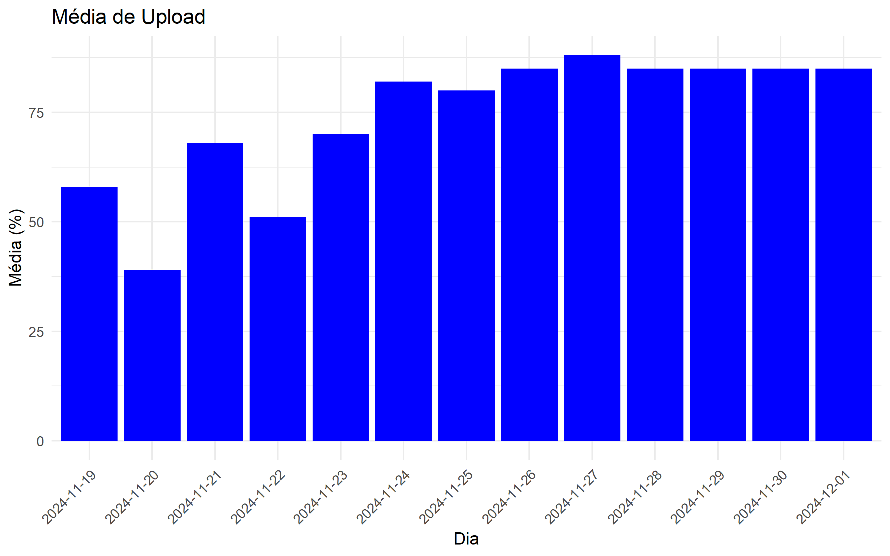
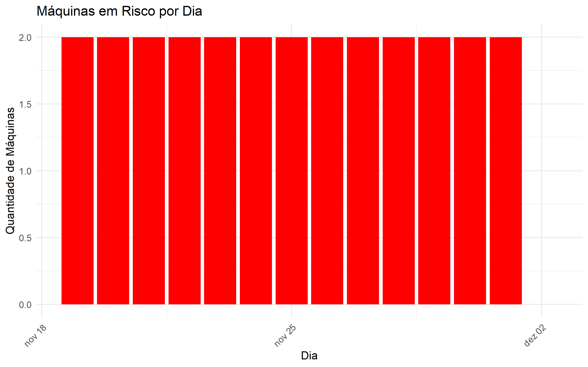

# Relatório de Captura

Este relatório apresenta as análises de desempenho e riscos com base nas capturas de dados dos últimos 14 dias.

## Gráfico 1: Média de Upload (RedeEnviada)

Este gráfico mostra a média diária de dados enviados (upload) pelos dispositivos monitorados.

## Gráfico 2: Média de Download (RedeRecebida)

Este gráfico mostra a média diária de dados recebidos (download) pelos dispositivos monitorados.

## Gráfico 3: Média de Uso de CPU

Este gráfico apresenta a média diária do uso de CPU pelos dispositivos monitorados.

## Gráfico 4: Máquinas em Risco

O gráfico abaixo apresenta o número de máquinas consideradas em risco a cada dia.

# Conclusão

Os gráficos acima destacam as métricas mais relevantes do monitoramento de dispositivos nos últimos 14 dias. As análises específicas podem ser feitas com base nos padrões observados.